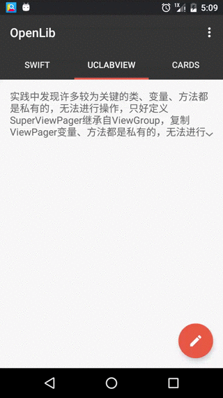

## 支持展开的TextView －－ExpandTextView
 参考开源项目[ExpendableTextView](https://github.com/Manabu-GT/ExpandableTextView)，原项目使用LinearLayout包装TextView和Button的做法，需要保证id的一致，，文本内容需要在代码中设置，操作较为复杂，故修改继承自TextView，保留TextView完整特性，简化操作。

#### 效果图


#### 属性
- maxCollapsedLines 设置开始折叠的行数
- animDuration 展开/折叠动画时长
- animAlphaStart  透明度渐变起始值
- expandDrawable  指示展开状态的图标
- collapseDrawable 指示折叠状态的图标

#### 使用
```xml
<com.lcodecore.extextview.ExpandTextView
        android:layout_width="match_parent"
        android:layout_height="wrap_content"
        android:textColor="#666666"
        android:textSize="16sp"
        app:maxCollapsedLines="4"/>
```
按TextView的使用方法即可

#### 事件监听
et.setOnExpandStateChangeListener();

---
完善中
